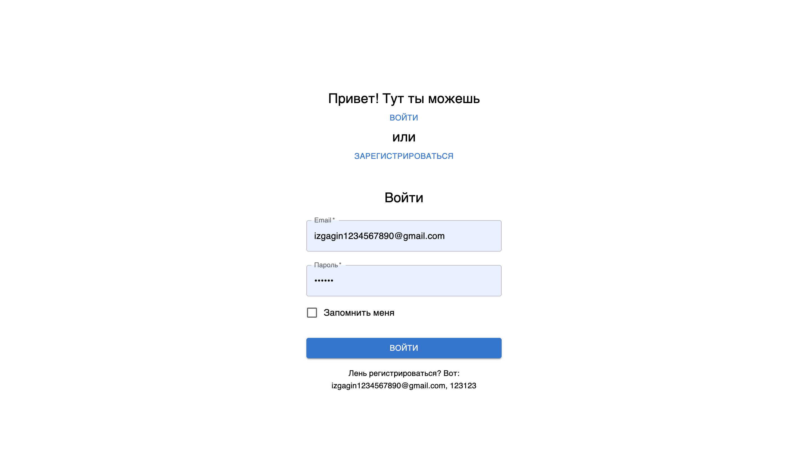
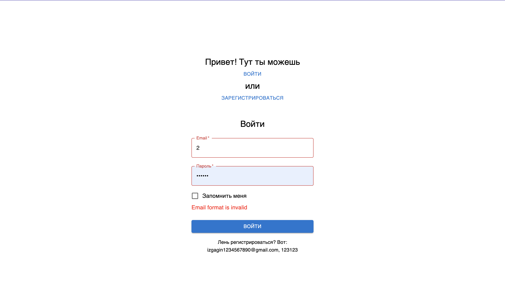
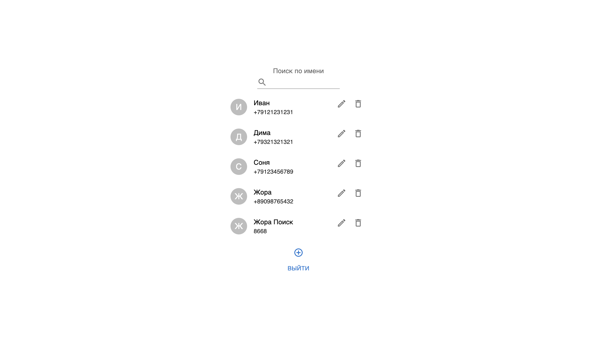
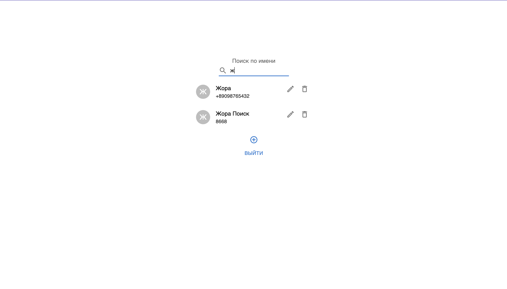
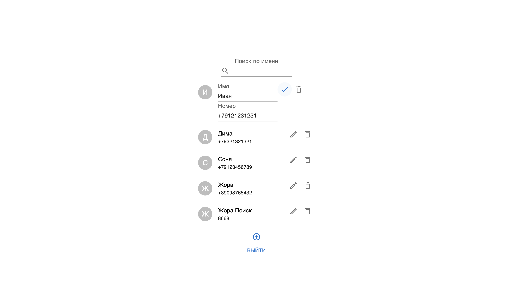
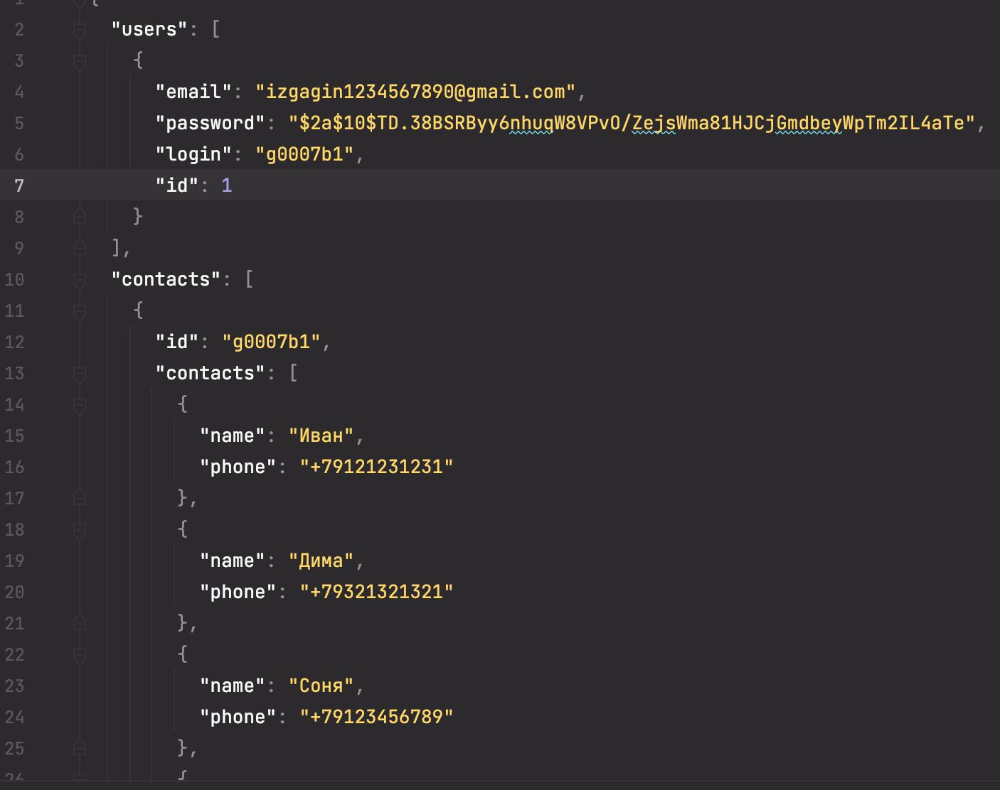

# Тестовое задание на вакансию Front-end Developer

### Версия node: v16.13.1
## Чтобы запустить проект нужно:
1) `git clone` репозитория
2) `npm install` для установки всех пакетов
3) `npm run startAll` для запуска сервера и приложения
4)Готово!
## Основной стек:
1) React: 18.2.0
2) Redux: 4.2.0
3) Typescript: 4.8.3
4) Json-server: 0.17.0
5) Axios: 0.27.2
6) Mui/material: 5.10.5

## Скриншоты работы:
#### Реализованы все требования в ТЗ

#### Каждое поле валидируется

#### После входа открывается список контактов пользователя

#### С возможностью поиска среди них

#### И редактированием каждого

#### Все данные сохраняются на сервер в файл

## Задание:
Необходимо написать приложение личный кабинет.
В приложении должно быть две страницы:
1) Страница входа
2) Страница со списком контактов

Оформление и данные для заполнения страниц на усмотрение кандидата.
Обязательно наличие информации в readme о том, как запускать приложение. Так же необходимо указать версию node (узнать можно с помощью команды node -v)
Для выполнения тестового задания Вы можете использовать UI-библиотеку компонентов (MUI, antd и т.д.).
Задание необходимо выполнить на TypeScript, без использования any и ts-ignore.
При выполнении работы обязательно использовать стейт менеджер (redux, mobx)
Время на выполнение тестового задания не ограничено.

Страница входа

Для реализации авторизации можно использовать запросы с моковыми данными https://github.com/typicode/json-server.

Страница со списком контактов

Страница со списком контактов пользователя должна быть доступна только после авторизации.

